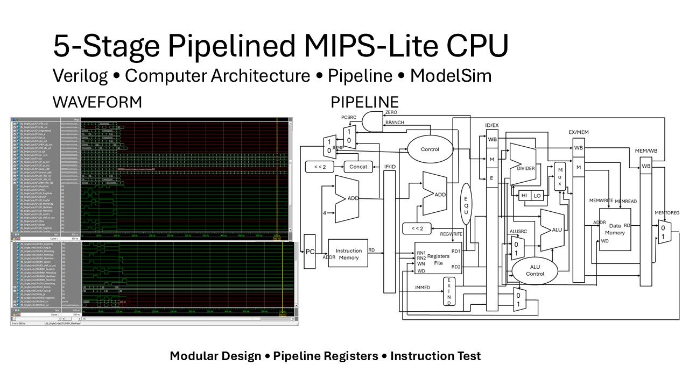
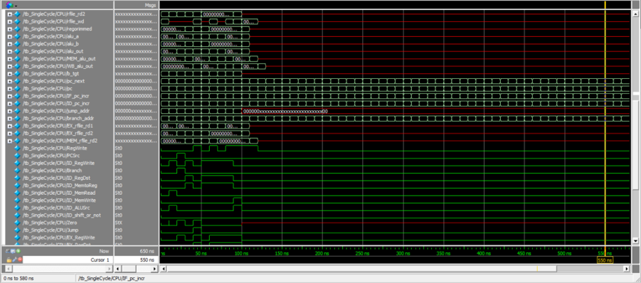

# 5-Stage Pipelined MIPS-Lite CPU

A 5-stage pipelined MIPS-Lite CPU implemented in Verilog, integrating modular arithmetic, control, memory, and pipeline components with ModelSim verification.



## Overview

This project was developed in two stages as part of a Computer Organization course.

During the first stage, we implemented and verified individual processor components such as the ALU, shifter, divider, HiLo registers, multiplexers, and supporting arithmetic modules.

During the second stage, these components were integrated into a 5-stage pipelined MIPS-Lite CPU following the classic:

**IF → ID → EX → MEM → WB**

pipeline structure.

Pipeline registers are used between each stage to transfer data and control signals across clock cycles.

---

## Project Development

### Phase 1 — Core Component Design

The first stage focused on implementing reusable datapath components required by the processor.

| Component | Purpose |
| --- | --- |
| ALU / TotalALU | Arithmetic and logical operations |
| ALU Control | Selects operations according to instruction control signals |
| Adder | PC and address-related calculations |
| Barrel Shifter | Shift operations such as `srl` |
| Divider | Multi-cycle unsigned division |
| HiLo Registers | Store quotient and remainder results |
| Multiplexers | Select datapath sources based on control signals |
| 32-bit Register | Temporary data storage |

These components were individually tested before being integrated into the CPU.

---

## Architecture

The processor follows a classic 5-stage pipeline:

```text
          ┌──────┐
          │  IF  │
          └──┬───┘
             │
          IF / ID
             │
          ┌──▼───┐
          │  ID  │
          └──┬───┘
             │
          ID / EX
             │
          ┌──▼───┐
          │  EX  │
          └──┬───┘
             │
          EX / MEM
             │
          ┌──▼───┐
          │ MEM  │
          └──┬───┘
             │
          MEM / WB
             │
          ┌──▼───┐
          │  WB  │
          └──────┘
```

### IF — Instruction Fetch

Fetches the instruction from instruction memory and calculates the next program counter value.

### ID — Instruction Decode

Decodes the instruction, generates control signals, and reads source operands from the register file.

### EX — Execute

Performs arithmetic, logic, shift, comparison, and address calculations using the ALU and related execution modules.

### MEM — Memory Access

Handles data memory read and write operations.

### WB — Write Back

Writes ALU or memory results back into the register file.

---

## Pipeline Registers

Four pipeline register modules transfer data and control signals between stages:

```text
pipeline_IF_ID
pipeline_ID_EX
pipeline_EX_MEM
pipeline_MEM_WB
```

Each pipeline register stores the required values at the clock edge so that multiple instructions can progress through different stages simultaneously.

---

## Main Components

| Module | Description |
| --- | --- |
| `mips_single.v` | Top-level processor integration |
| `control_single.v` | Main control signal generation |
| `ALUControl.v` | ALU operation control |
| `TotalALU.v` | Integrates arithmetic, shift, division and HiLo functions |
| `ALU32bit.v` | 32-bit arithmetic and logic unit |
| `Shifter.v` | Barrel shifting operations |
| `Divider.v` | Unsigned division |
| `HiLo.v` | HI / LO register storage |
| `reg_file.v` | Register file with two read ports and one write port |
| `memory.v` | Instruction and data memory |
| `sign_extend.v` | Immediate sign extension |
| `checkEqual.v` | Equality checking used by branch logic |
| `jump_mux.v` | Jump-related datapath selection |

---

## Supported Instructions

The current implementation supports several R-type, memory, branch, and jump instructions.

| Category | Instructions |
| --- | --- |
| Arithmetic / Logic | `add`, `sub`, `slt` |
| Shift | `srl` |
| Division | `divu`, `mfhi`, `mflo` |
| Memory | `lw`, `sw` |
| Branch | `beq` |
| Jump | `j`, `jal` |

---

## Simulation & Verification

The processor was tested using a Verilog testbench and ModelSim waveform simulation.



Instruction memory, data memory, and register values are initialized using:

```text
data/instr_mem.txt
data/data_mem.txt
data/reg.txt
```

Waveform analysis was used to verify the propagation of instructions, datapath values, control signals, memory operations, and register write-back across pipeline stages.

---

## My Contribution

This project was developed as a three-person team project.

### Core Component Stage

My responsibilities included:

- Barrel Shifter implementation
- Multiplexer implementation
- Component testbench and verification

### Pipeline Integration Stage

I collaborated with the team on:

- Pipeline register implementation
- Module integration
- Debugging processor behavior
- ModelSim waveform testing and verification

---

## Current Limitations

The current design does not yet implement complete hazard detection or data forwarding.

The `divu` module is a multi-cycle operation and is not fully integrated into the pipeline timing model. Division results are currently accessed through the HI / LO registers.

Possible future improvements include:

- Hazard detection
- Data forwarding
- Pipeline stall control
- Improved branch handling
- Full multi-cycle divider integration

---

## What I Learned

Through this project, I gained practical experience with:

- Verilog hardware description
- Modular datapath design
- CPU pipeline architecture
- Control and data signal propagation
- Register and memory design
- Hardware debugging
- ModelSim waveform analysis
- Integration of independently developed hardware modules

The project helped me understand how individual processor components are combined into a functioning pipelined CPU and how timing and control signals affect instruction execution.
